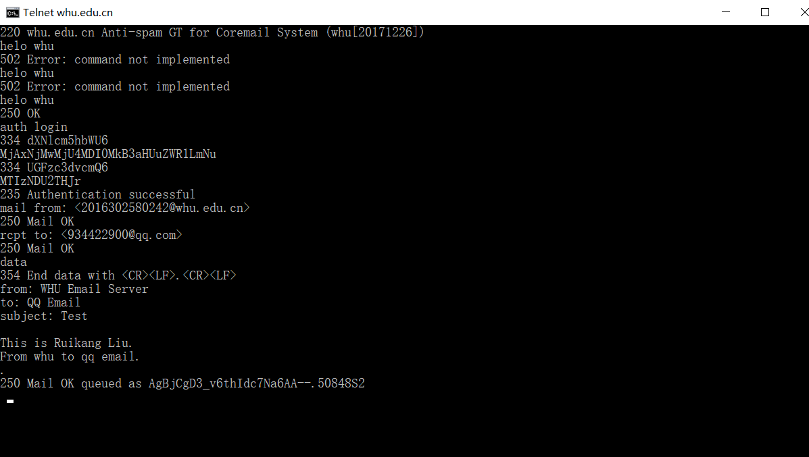
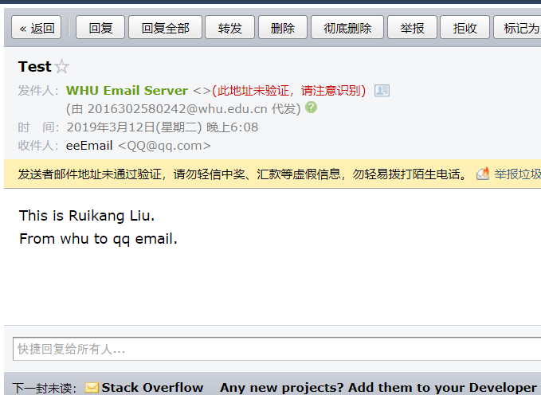

---

### telnet whu.edu.cn 25

- first, start the corresponding service of windows

- open the command line and type in commands

- here is the result, which means the refusal of Coremail Anti-spam GT

---

### 1

a. F

Request message and response message should be corresponding one by one

b. T

c. F

One TCP segment can only carry with one HTTP request message

d. F

The header line suggests the time of generation and transmission of the response message

e. F

Sometimes it's empty

### 3

Application layer protocols include DNS and HTTP

Transport layer protocols include UDP and TCP

### 4

a. http://gaia.cs.umass.edu/cs453/index.html

b. HTTP 1.1

c. persistent connection

d. don't know 

e. Mozilla/5.0. With detailed browser information, the server can possibly send customized content of the corresponding browser.

### 5

a. yes. the status code is 200. 2008.3.7 12:39:45 GMT

b. 2005.12.10 18:27:46 GMT

c. 3874 bytes

d. <!doc

yes. Connection: Keep-Alive

### 7

Tall = 2*RTT0 + RTT1 + ... + RTTn 